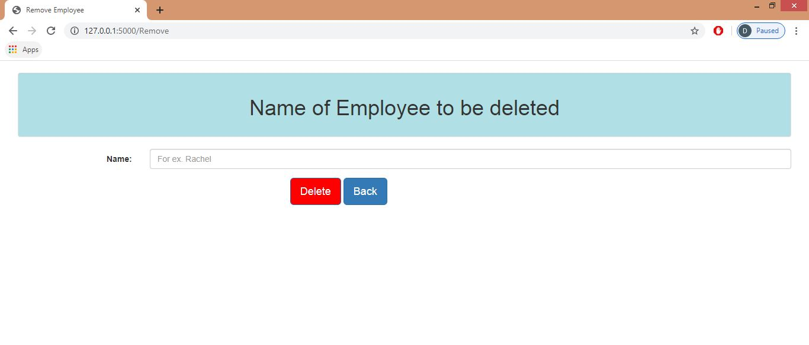

# Smiple-Web-Appication-using-Flask
Web application was developed using [Python flask](https://flask.palletsprojects.com/en/1.1.x/) and [MYSQL](https://www.mysql.com/) Database. This web application demonstrates how general web applications perform CRUD functions on Database.

Below are the steps required to be performed before running the project:
1. Install and configure Web server
2. Create Database and Table

# Pre-requisities
## 1. Install and configure Web server
I have used pycharm IDLE for developing this web application. Following is the command through which flask can be installed.
```
pip install flask
pip install flask-mysqldb
pip install PyYAML
```


## 2. Create Database and Table
For this project I have created Database and table manually. Following is command for creating it.
```
create DATABASE employeedetails
create TABLE users(Name VARCHAR(20), Desgination VARCHAR(20), Address VARCHAR(30), Phone BIGINT(10))
```
# Host Web application
For execution for above provided code. Above pre-requisities should be followed. Following are the steps to run it.
1. Download the code using clone/Download button from source repository
2. Unzip the downloaded code in python project folder (where others python projects are been stored)
4. configure Database Credentials and parameters in db.yaml file.
3. run app.py file. Web application would be hosted locally.

Below shown are the screenshots of web application developed.
# Screenshots of Web application

   
