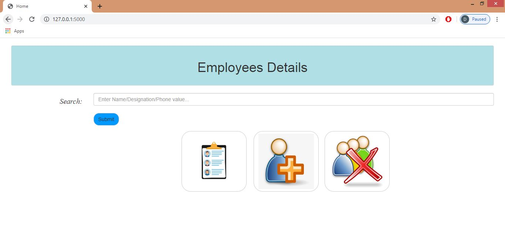
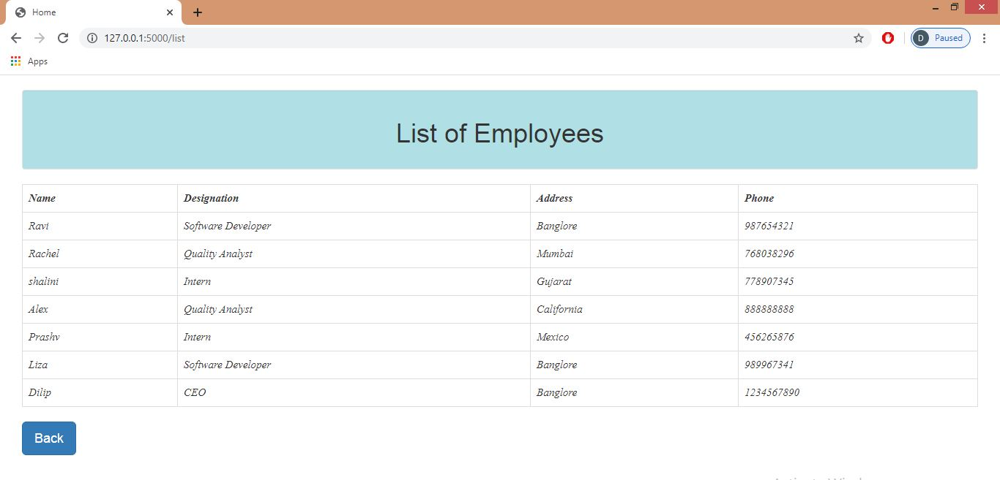
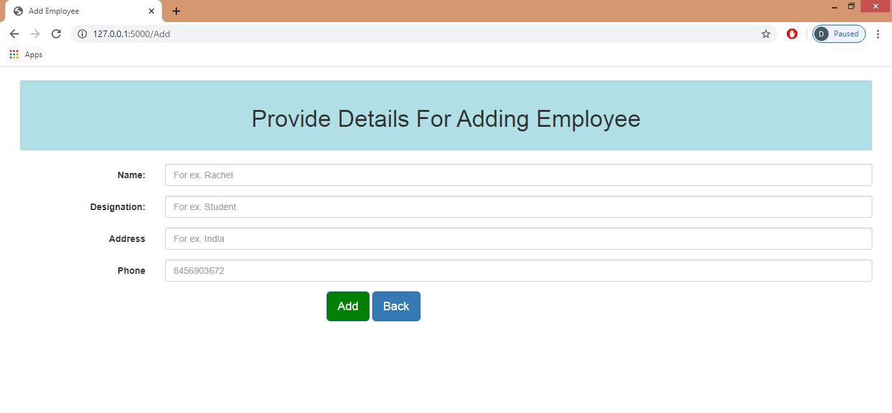

# Smiple-Web-Appication-using-Flask
This is simple yet elegant web application developed using [Python flask](https://flask.palletsprojects.com/en/1.1.x/) and [MYSQL](https://www.mysql.com/) Database. This web application demonstrates how other web applications perform CRUD functions on Database.

Below are the steps required to be performed before running the project:
1. Install and configure Web server
2. Create Database and Table

## 1. Install and configure Web server
I have used pycharm IDLE for developing this web application. Following is the command through which flask can be installed.
```
pip install flask
pip install flask-mysqldb
pip install PyYAML
```
- Download Code from source repository and place it in pycharm project folder
- configure Database Credentials and parameters in db.yaml file.

## 2. Create Database and Table
For this project I have created Database and table manually. Following is command for creating it.
```
create DATABASE employeedetails
create TABLE users(Name VARCHAR(20), Desgination VARCHAR(20), Address VARCHAR(30), Phone INT(12))
```
# Screenshots of Web application

   
